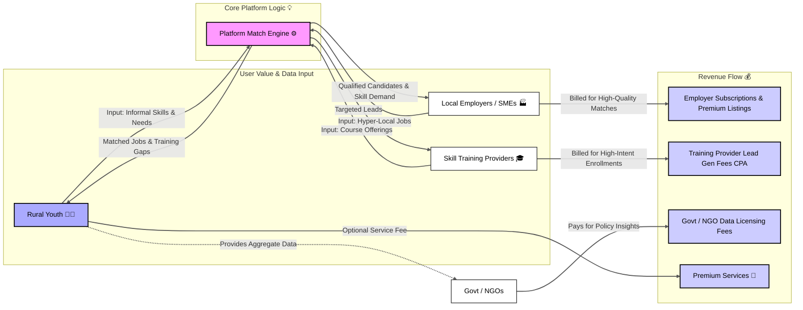

<h1>Business Model<h1>


```mermaid
graph TD
    %% Define Nodes with Icons and Styling
    A[<i class='fa fa-user'></i> Rural Youth/Worker]:::user --> B{Access Platform};
    B --> C{Vernacular/Voice Input};
    C --> D(AI Non-Formal Skill Indexing);
    D --> E{AI-Enabled Recommendation Engine};
    
    E --> F[<i class='fa fa-map-marker'></i> Hyper-Local Job Index];
    F --> G(Job Match & Skill Gap Analysis);
    
    G --> H{Match Found?};
    
    H -- Yes: Direct Match --> I[<i class='fa fa-check-circle'></i> Job/Livelihood Opportunity];
    H -- No: Skill Gap Exists --> J(Personalized Skill-Gap Analysis);
    
    J --> K[<i class='fa fa-graduation-cap'></i> Local Training Recommendation];
    
    K --> L(Career Pathing: Upskill);
    L --> E; %% Loop back to the recommendation engine after upskilling

    I --> M[<i class='fa fa-rocket'></i> Sustainable Employment/Self-Sufficiency];
    
    %% Define Node Styles
    classDef user fill:#9ED6E7,stroke:#0077B6,stroke-width:2px;
    classDef ai fill:#D4EDDA,stroke:#155724,stroke-width:2px;
    classDef gap fill:#FFF3CD,stroke:#856404,stroke-width:2px;
    classDef result fill:#DCF8C6,stroke:#38761D,stroke-width:2px;
    
    class A,M user;
    class D,E ai;
    class J gap;
    class I,K,L,F result;
```